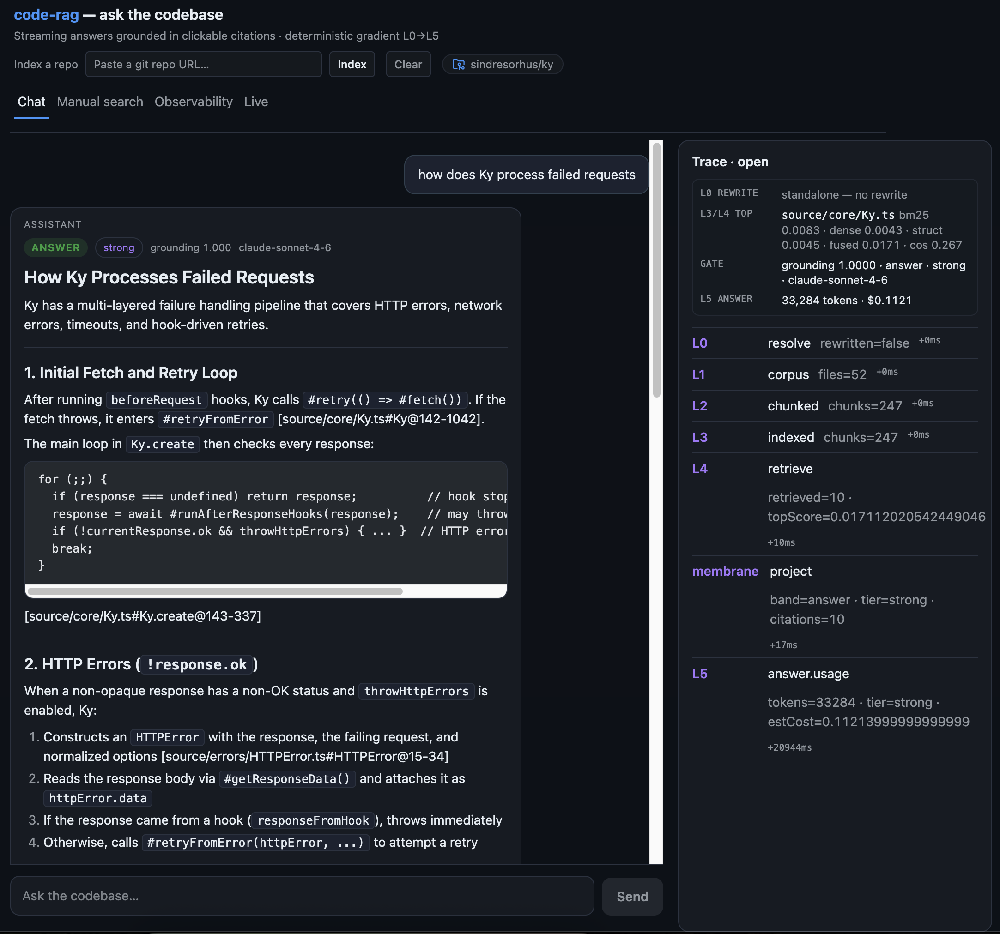
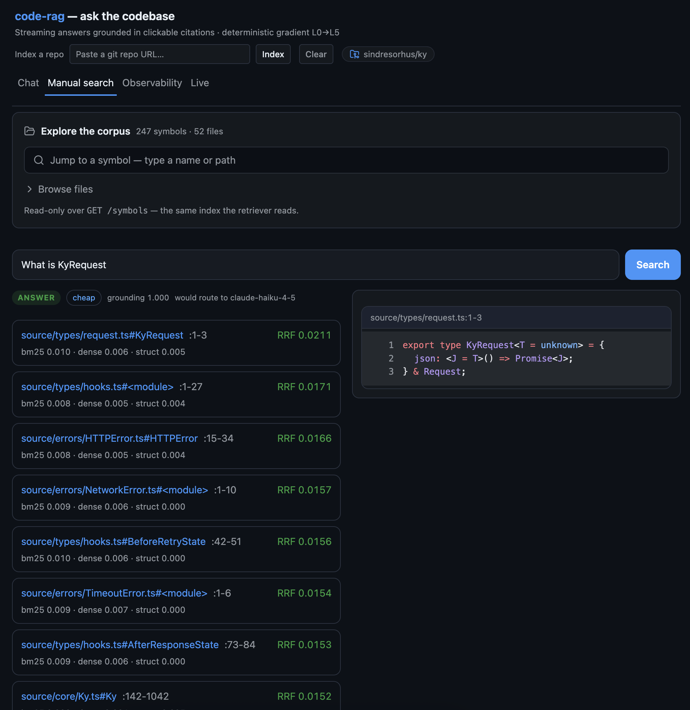
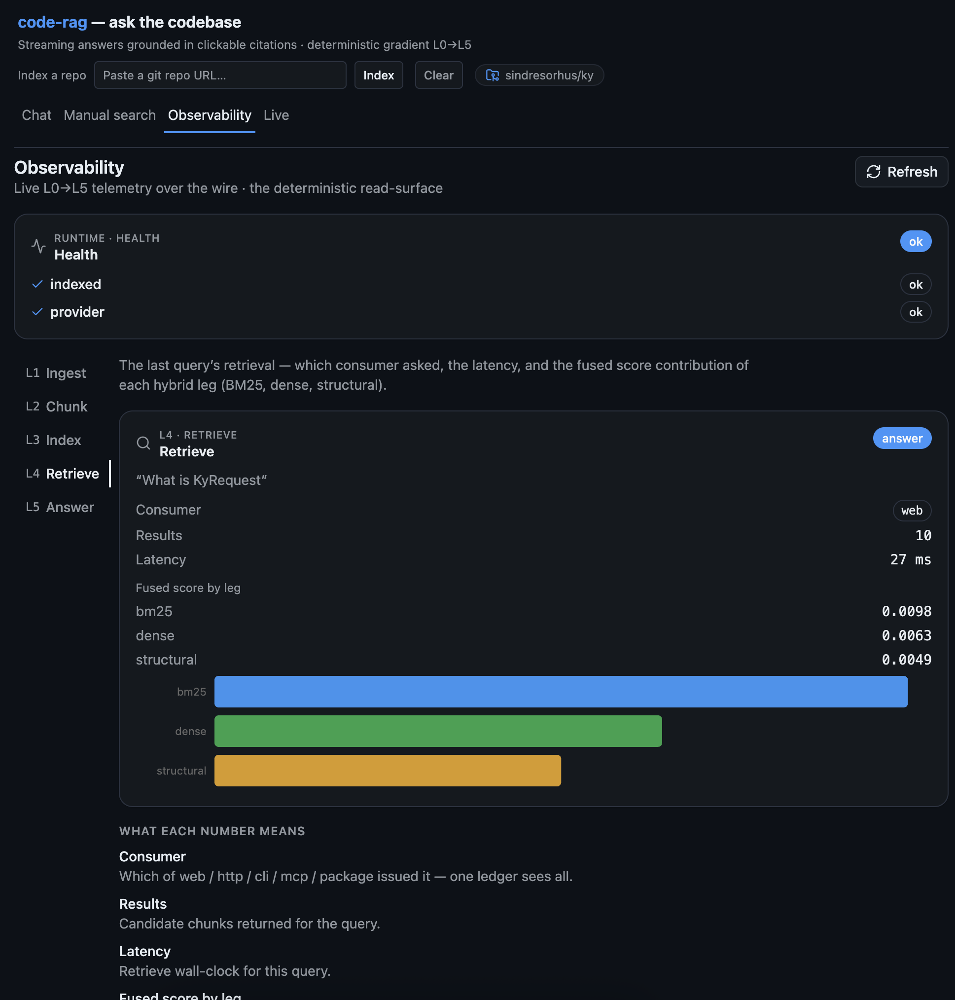
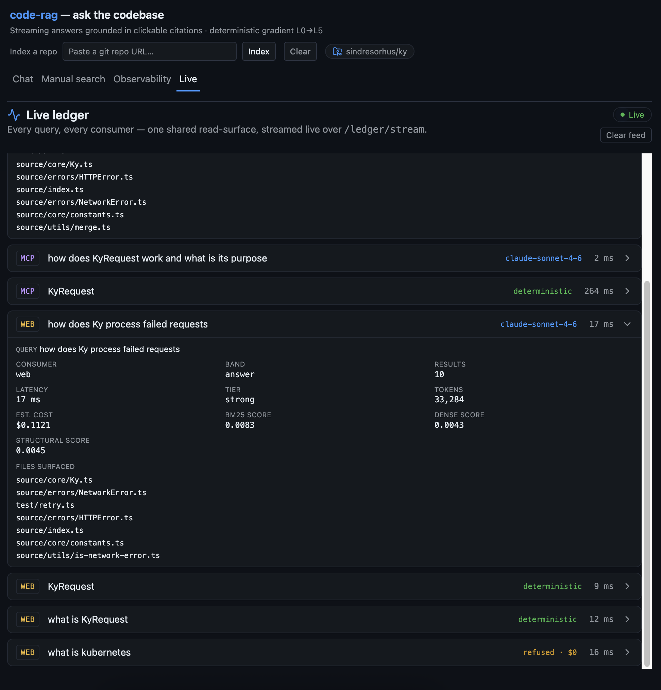

# code-rag — a code documentation assistant

Conversational RAG over a codebase. Ask how the code works, where something is
implemented, what an endpoint does, what depends on what — and get an answer
**grounded in retrieved code, with clickable citations**, or an honest refusal when
the code doesn't support one.

Built for the NewPage FDE take-home (Option 2). The product name is a placeholder.

> **Design decisions, trade-offs, engineering standards, the AI-assisted workflow, and the
> productionization path → [`docs/DESIGN.md`](docs/DESIGN.md).** This README is the setup + tour.

---

## Screenshots

| Chat — streamed answer + live L0→L5 trace | Manual search — deterministic, per-leg scores |
|:---:|:---:|
| [](docs/screenshots/01-chat-with-trace.png) | [](docs/screenshots/02-manual-search.png) |
| **Observability — per-layer L1→L5 telemetry + health** | **Live ledger — every consumer (web · cli · mcp), one feed** |
| [](docs/screenshots/03-observability.png) | [](docs/screenshots/04-live-ledger.png) |

---

## Walkthrough (video)

A three-part screen recording — the running app + the design reasoning behind it:

1. **[Design & the determinism gradient](https://cap.link/s4cjhs9avqchvmg)** — the architecture, and why the LLM is the last and smallest step.
2. **[Retrieval, the refuse / cheap / strong gate, and observability](https://cap.link/6fqarv14pvrhhys)** — hybrid retrieval, cost/grounding routing, and the per-layer telemetry.
3. **[One engine, many consumers](https://cap.link/r7f301f70hn796e)** — the same engine over the web, an MCP coding agent, and the CLI, all landing in one live ledger.

---

## The one idea: a determinism gradient

Most of a RAG system can be computed **exactly**. Walking the repo, chunking by
symbol, retrieval, ranking, building citations, deciding whether there's even enough
evidence to answer — none of that needs a language model, and all of it can be
unit-tested. So I pushed the LLM to be the **last and smallest** step: it writes the
final prose, from a context it cannot deviate from, and nothing else.

That gives a pipeline that runs left-to-right from fully deterministic to probabilistic:

```
   deterministic  ───────────────────────────────────────────▶  probabilistic
   L0          L1         L2         L3            L4          ·          L5
   resolve  →  ingest  →  chunk   →  index      →  retrieve →  project →  answer
   anaphora    walk       by-symbol  BM25+dense    hybrid      cite +     stream
   gate        the repo   tree-      +structural   RRF fusion  score-     (the ONLY
   (+rewrite)             sitter     (1 SQLite)    parallel    gate       LLM call)
```

Everything up to L5 is exact and tested (over 900 tests). **L5 is the only place a model
runs**, and even there a deterministic score-gate decides *whether* it runs at all and
*which* model. The payoff: answers are reproducible up to the generation step,
ungrounded questions are refused instead of hallucinated, and every query emits a
per-layer event trace you can watch.

---

## Architecture

**The membrane is the seam.** A single `createEngine()` composes the otherwise-pure
layers, holds the retrieval index in memory, and owns the cross-cutting concerns no
single layer should: it assembles the context + citations, mints the query id, runs
the event bus, and computes cost. The layers don't import each other — the membrane
wires them behind one `Projection` (the single source of truth for a query).

**Contracts-first.** Every layer is written against a shared set of TypeScript
contracts (`Chunk`, `RankedChunk`, `Projection`, `Provider`, `Event`). The contracts
*are* the test surface — layers are tested against behaviour and invariants, not each
other's internals — which is what let the layers be built in parallel and still
integrate cleanly.

**Consumer-agnostic.** That one `Projection` feeds every consumer unchanged: the Node
package (in-process), the HTTP/SSE server, the browser UI, a terminal **CLI**, and an
**MCP server** — five consumers behind one projection, and adding the CLI and MCP took
**zero** core change (the engine already split `query` from `answer` for exactly this).

**No orchestration framework, on purpose.** No LangChain / LlamaIndex. The gradient
*is* the orchestration — explicit, typed, and testable control flow. A framework would
have hidden the one thing this design is about.

```
src/
  contracts/   the SSOT types every layer builds against
  ingest/      L1 — deterministic repo walk
  chunk/       L2 — tree-sitter chunk-by-symbol + structural refs
  index/       L3 — BM25 (FTS5) · local-ONNX dense vectors · unified SQLite store
  retrieve/    L4 — hybrid RRF fusion + the gold-query eval harness
  answer/      score-gate · cost · prompt assembly · guardrails
  provider/    the Claude provider (streamed answer + anaphora rewrite)
  membrane/    createEngine — the master-owned seam that composes it all
  http/        the surface: SSE /query, JSON /search, WS /ws/trace
  consume/     the shared verbs the CLI + MCP bind (buildEngine · ask · serializeProjection)
  cli/         code-rag ask <query> [--dry --json] — the deterministic path needs no key
  mcp/         MCP server: ask + search tools over stdio, projection as structuredContent
  bus/ package/ event bus + the package Consumer API
web/           standalone React UI (chat · citations · live trace · manual search)
```

---

## Retrieval — hybrid, and measured

Three legs run **in parallel** (not a cascade) and are fused with Reciprocal Rank
Fusion (`k=60`, code-tuned weights `bm25:0.6 / dense:0.4 / structural:0.3`):

- **BM25** (SQLite FTS5) — exact lexical match, with index-time identifier splitting
  (`getUserById` → `get user by id`) so partial-word queries land.
- **Dense** — local ONNX embeddings (`all-MiniLM-L6-v2`, int8), **run on-device** —
  there is no embedding API and no key for it.
- **Structural** — the call/import graph, expanded one hop from the lexical + dense
  seeds, so a strong hit pulls in its neighbours.

I measured it on the assistant's **own `src/`** (the repo documenting itself), with a
22-query gold set across four buckets:

| bucket   | recall@10 | what it probes                         |
|----------|-----------|----------------------------------------|
| keyword  | **1.00**  | exact identifier in the query          |
| mixed    | **0.80**  | identifier + natural language          |
| semantic | 0.20      | pure NL, identifier absent             |
| zero-id  | 0.00      | NL the lexical leg can't latch onto    |
| **overall** | **0.50** | (BM25 + structural *alone* = 0.273) |

**The dense leg lifts overall recall +83%** (0.273 → 0.50) and takes exact-identifier
search from 0.50 → **1.00** — the empirical case for parallel-not-cascade, each leg
recovering what the others miss. The common code-doc queries (identifier / identifier
+ NL) are where it's strong; **semantic 0.20 is the honest ceiling of a general-purpose
embedder**, and the documented one-line upgrade to `jina-embeddings-v2-base-code` is
exactly for raising it. The de-weighted (0.4) MiniLM default is right-sized for
clone-and-run reliability, not for pure NL↔code recall. Full table + reproduction:
[`src/retrieve/eval.md`](src/retrieve/eval.md).

---

## Answer, refuse, and cost — one deterministic gate

Before any model runs, a pure score-gate reads two signals:

- **Grounding** — two *additive* signals: lexical overlap (do the query's terms appear in the
  retrieved code?) **OR** the raw dense cosine of the top hits (absolute semantic relevance). If
  neither grounds, the assistant **refuses** rather than invent one. (A real-corpus dogfood proved
  the RRF fused score is a poor grounding signal — rank-based, no calibrated magnitude — so the gate
  scores lexical overlap; a raw-cosine floor was added so a semantically-strong pure-NL query is no
  longer false-refused for want of exact terms. The floor is corpus-tuned, never a baked confidence.)
- **Complexity** (distinct files + query intent) → a model **tier** (`cheap` haiku vs
  `strong` sonnet) — cost routing.

Only on `answer` does the provider stream tokens; the final `L5` event carries the
**real** token usage from the SDK and the estimated cost. Guardrails: a system policy
to answer only from the retrieved context, deterministic citations built from the
retrieval (with a post-check available), and the refuse path.

**Measured, not estimated.** Three real questions through the CLI
([`scripts/cost-dogfood.ts`](scripts/cost-dogfood.ts)) — all three routed to `strong`,
because the gate's OR-escalation (2+ files in context *or* a reasoning word like *how*)
deliberately prefers quality over saving a cent:

| path | model | cost / query |
|------|-------|--------------|
| `--dry` · `search` · the MCP retrieval tool | none | **$0** — no model runs |
| answer, substantive question (`strong`) | sonnet-4-6 | **~$0.027** (measured) |
| answer, trivial single-file lookup (`cheap`) | haiku-4-5 | ~$0.009 (cost model) |

So the determinism gradient is also a *cost* gradient: everything left of L5 is free, and
even L5 is gated to the smallest model that fits.

---

## Run it

The only key is `ANTHROPIC_API_KEY`, and only for a *streamed answer* — **embeddings run locally**, so
`search` / `stats` / `ask --dry` / the trace need no key. Copy `.env.example` to `.env` (auto-loaded by
the CLI, server, and MCP; real exports + compose env still win) or pass the vars inline.

**One safety rule.** The dense (ONNX) leg embeds the corpus on-device the first time, and a cold
whole-repo embed is CPU-heavy — so dense is **opt-in**. The default is BM25 + structural (instant, fully
offline, never freezes); `CODE_RAG_DENSE=true` enables the semantic leg. Enabling it over a whole repo is
*refused* with an actionable message on every consumer, so scope `CORPUS_PATH` first.

> **Shell.** The commands below assume a POSIX shell (macOS/Linux, WSL, or Git Bash). On native Windows
> PowerShell, put the key in `.env` (`copy .env.example .env`) instead of the inline `VAR=… cmd` form, and
> use `copy` for `cp`. Docker Desktop and the auto-loaded `.env` make the Windows path the same either way.

### Docker — the whole stack, one command

```bash
ANTHROPIC_API_KEY=sk-... docker compose up --build   # server :8787 + web UI :5173, both built in-image
```

Open <http://localhost:5173>. BM25 by default (no freeze); scope with `CORPUS_PATH=./src`, or index a git
repo with `CODE_RAG_REPO=<url>`. Opt into dense later with `CODE_RAG_DENSE=true` on a scoped corpus.

### Local — Node 20+, the same engine

```bash
npm install && npm run build     # dist/ + the tree-sitter grammar copy; a CI run-it step guards the bin

# a safe first query — deterministic, offline, no key, $0
node dist/src/cli/index.js ask "how does retrieval fuse the legs" --dry
# a streamed answer (needs the key; still dense-off = heat-safe)
ANTHROPIC_API_KEY=sk-... node dist/src/cli/index.js ask "how does the score gate work"

# the HTTP server + web UI in dev
CORPUS_PATH=src npm run serve
cd web && npm install && VITE_API_BASE=http://localhost:8787 npm run dev
```

`npm link` once for a global `code-rag` (`code-rag ask … --dry`). The CLI verbs are
`ask`/`stats`/`health`/`log`/`symbols`; `ask --dry` and the read-surfaces need no key, only a streamed
`ask` does. (Deterministic `search` is `ask --dry` on the CLI, a tool over the MCP, and `POST /search`.)

### Opt into dense (higher recall, CPU-heavy)

Dense lifts overall recall +83% and exact-id search to 1.00 — turn it on once the corpus is scoped:

```bash
CORPUS_PATH=src CODE_RAG_DENSE=true CODE_RAG_INDEX=.code-rag/index.db npm run serve
```

`CODE_RAG_INDEX` persists the index so a 2nd run re-embeds only changed files (warm restart). To index
another repo, `code-rag ask --repo <git-url> "…"` clones it to a warm cache.

### Use it from your coding agent (MCP)

```bash
npm run build && cp .mcp.json.example .mcp.json   # already have a .mcp.json? merge the "code-rag" block
export ANTHROPIC_API_KEY=sk-...                   # optional — only a streamed ask needs it
```

Reopen the repo in Claude Code / Cursor / Codex (or reconnect MCP) → the code-rag `search` / `ask` /
`symbols` / `stats` / `health` tools appear, scoped + heat-safe. The agent uses its own subscription, so
`ask`/`search` cost no per-call API tokens.

Open the printed Vite URL: streaming chat with a grounding/cost badge, clickable citations
into a source viewer, a live L0→L5 trace rail, a manual-search tab that shows the per-leg
scores, and an **Observability** tab (per-layer L1→L5 telemetry + health, read over the wire).
The whole pipeline is also usable in-process via the package (`createEngine`).

### Known limitations (running it)

- **Dense is opt-in** — the on-device cold embed is CPU-heavy, so the default is BM25 + structural
  (fully offline, no ~25 MB download). A >200-file cold dense-embed is refused on every consumer.
- **Cross-OS** — Node 20+; the Docker base is `node:20-slim` (glibc) **not** alpine, because
  `onnxruntime-node` / `better-sqlite3` need glibc prebuilds. `VITE_API_BASE` is baked into the web
  bundle at build time, so remapping the server port needs a rebuild. macOS dense needs
  `onnxruntime-node ≥1.24.3` (pinned).
- **Warm restart** — the first index is cold; `CODE_RAG_INDEX` makes reruns warm (mtime/size delta).

---

## Engineering standards

- **TypeScript strict**, **Biome** (lint + format), **vitest** (TDD, red→green).
  **over 900 tests**; the critical paths — membrane, retrieval fusion, the score-gate, the
  guardrails, the wire — get edge + negative coverage.
- **CI** gates the backend (Biome + tsc + vitest) and the web build, on every push.
- **A commit pipeline built for AI-authored commits** (husky + commitlint + Biome on
  staged files): Conventional Commits with per-layer scopes, and a hard line on
  `--no-verify` — because the lesson from running coding agents at scale is that
  enforcement has to live *outside* the agent, with CI as the real backstop. The git
  history is the curated, attributed record.

---

## How I used AI tools

The multi-agent method I built this with (master / specialists / executor), the non-bypassable
enforcement gates, and my do's & don'ts — in my own words →
**[`docs/DESIGN.md`](docs/DESIGN.md)**.

---

## Cost & productionize (the scale path)

- **Cost** is score-gated (refuse / cheap / strong) and metered per query via the L5
  event. A metered API key suits a self-hosted deploy; an MCP-subscription surface
  (the built MCP server) suits an editor-embedded one.
- **Retrieval** scales brute-force cosine → `sqlite-vec` → `pgvector` / Qdrant without
  touching the membrane (the legs are injected).
- **Embeddings** upgrade MiniLM → `jina-v2-base-code` / Voyage-code-3 in one config line.
- **Surface** — all five consumers ship behind the one `Projection`: package, HTTP/SSE,
  web UI, **CLI**, and **MCP**. The MCP server is the editor-embedded cost story — an agent
  on a Claude/Cursor subscription runs `ask`/`search` at **no per-call API cost**; the
  metered API path (the numbers above) suits a self-hosted deploy. Shipped: a compiled `dist`
  bin (the tree-sitter grammar copied in) + a multi-stage Dockerfile and `docker-compose` (server
  + web), so the whole stack runs with one `docker compose up`.

---

## Limitations & what's next

- **`.tsx` deferred** — M1 indexes `.ts/.mts/.cts`; the chunker generalises to other
  tree-sitter grammars.
- **Semantic recall** is capped by the general embedder — the `jina-v2-base-code`
  upgrade is wired and one line away.
- **Structural eval is a floor** — the gold set targets symbol *definitions*, so it
  under-counts the structural leg's real value on "where is X used / how does this
  subsystem work" queries.
- **Cold-start** (dense only) — with `CODE_RAG_DENSE=true`, the first live query embeds the corpus
  (minutes on a large repo); the default BM25 path is instant. The index persists with a stat-only
  (mtime+size) warm-restart that re-embeds only changed files; wiring it into the server's lazy
  self-index is the remaining step.
- **Reranker** — grounding now ORs lexical overlap with the raw dense cosine (the absolute signal
  RRF ranks can't express). The remaining precision lever is a cross-encoder **reranker** applied
  after fusion on the top-K.
- **Embedder exits cleanly** (resolved) — `onnxruntime-node` ≤1.21 aborts the host process on
  teardown on macOS (`libc++abi: mutex lock failed`, exit 134 — `onnxruntime#24579`, fixed upstream
  by PR#26445). `@huggingface/transformers` pins it to 1.21.0, so the build overrides it to ≥1.24.3
  and the in-process dense embedder exits `0`. The `Embedder` interface stays the isolation seam if a
  consumer ever needs hard out-of-process fault-isolation (worker threads don't isolate a native abort;
  only a child process does).
- **FTS5 morphology** — Porter stemming so `upsert` / `upserted` match lexically.

## License

MIT.
